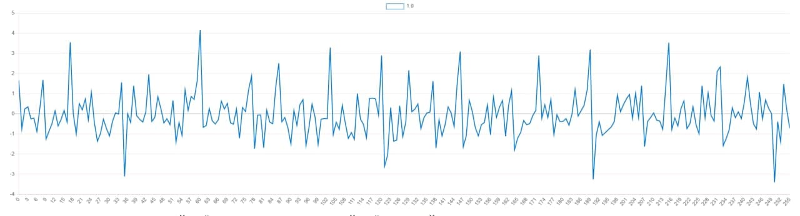

## ДОСЛІДЖЕННЯ І РОЗРОБКА МОДЕЛЕЙ ВИПАДКОВИХ СИГНАЛІВ. АНАЛІЗ ЇХ ХАРАКТЕРИСТИК

Назва                               |Значення
------------------------------------|-------
Число гармонік в сигналі            | 8
Гранична частота, ωгр               | 1100
Кількість дискретних відліків, N    | 256

## ДОСЛІДЖЕННЯ АВТОКОРЕЛЯЦІЙНОЇ І ВЗАЄМНОЮКОРЕЛЯЦІЙНОЇ ФУНКЦІЙ ВИПАДКОВИХ СИГНАЛІВ

#### Autocorrelation

#### Correlation

