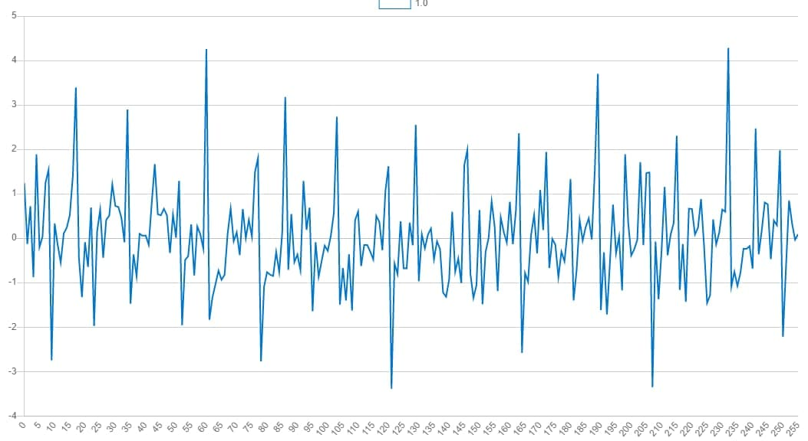
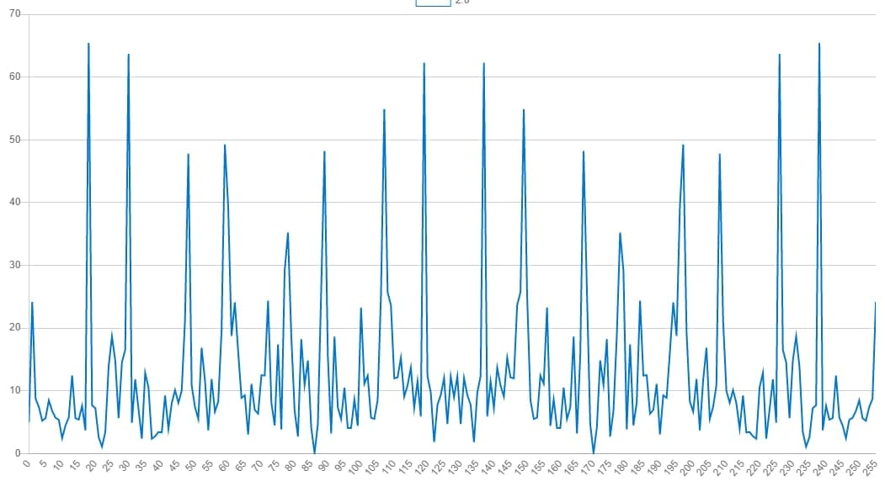
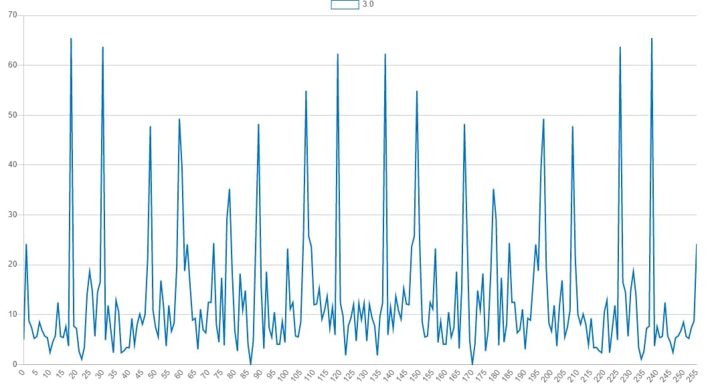

# Open online
https://drewmeltpool.github.io/realTimeSys/lab2/

### 2.1 ДОСЛІДЖЕННЯ ПАРАМЕТРІВ АЛГОРИТМУ ДИСКРЕТНОГО ПЕРЕТВОРЕННЯ ФУР'Є
https://drewmeltpool/realTimeSys/lab2/lab2.1.pdf
### 2.2 ДОСЛІДЖЕННЯ АЛГОРИТМУ ШВИДКОГО ПЕРЕТВОРЕННЯ ФУР'Є З ПРОРІДЖУВАННЯМ ВІДЛІКІВ СИГНАЛІВ У ЧАСІ
https://drewmeltpool/realTimeSys/lab2/lab2.2.pdf

### Варіант №3
Назва                               |Значення
------------------------------------|-------
Число гармонік в сигналі            | 8
Гранична частота, ωгр               | 1100
Кількість дискретних відліків, N    | 256

####  Випадково згенерований сигнал

#### DFT

#### FFT

